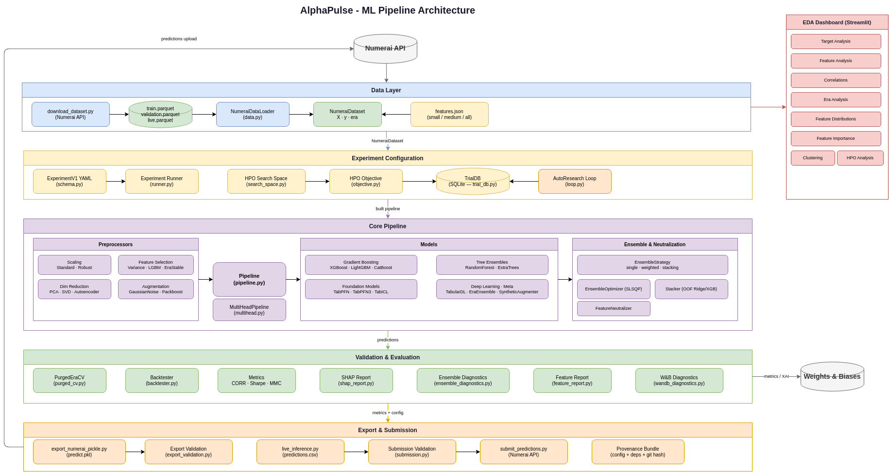

# AlphaPulse

AlphaPulse is a configuration-driven research framework for training, evaluating,
and exporting tabular models for the Numerai tournament. It supports strict YAML
experiments, era-aware validation, Optuna or Ray hyperparameter search, W&B
diagnostics, and portable `predict.pkl` bundles.

The project is also the engineering artifact of a master's thesis. The historical
2026 sweep remains in the repository as an exploratory record; it is not presented
as a ranking under current official Numerai scoring.



The architecture diagram source is editable in [draw.io](docs/assets/architecture.drawio).

## Methodological status

AlphaPulse now exposes two explicitly separated metric families:

- `numerai_corr_*` and `numerai_mmc_*` implement the frozen component definitions
  checked numerically against `numerai-tools==0.6.0`.
- `weighted_corr_mmc_*` is a diagnostic composition of per-era components. It is
  official only when its target, meta-model, component versions, and multipliers
  match the score configuration of a particular Numerai round.
- `corr_sharpe`, `mmc_sharpe`, and `payout_score` are retained for compatibility
  with historical AlphaPulse artifacts. They are legacy Spearman/residual proxies;
  `payout_score` is not an official Numerai payout.

The corrected HPO path uses a fixed row sample for every trial, separate data and
model seeds, horizon-aware purging (at least 8 eras for explicit 20-day targets and
16 for 60-day targets), and a versioned `protocol.json`. Resume is rejected if the
data, sample, source tree, Python environment, model pool, target, objective, or
validation regime changes.

The archived sweep contained 186 attempted configurations: 177 produced complete
metric vectors, 7 were rejected as infeasible, and 2 timed out. W&B shows 189 runs
because three additional runs contain summaries and diagnostics. Those results use
the legacy metric protocol and should be treated as exploratory evidence only.

## Requirements

- Python 3.12+
- Git
- [uv](https://docs.astral.sh/uv/)
- optional NVIDIA GPU for CUDA-enabled models

```bash
uv sync --extra dev

# Add only what the planned run needs.
uv sync --extra hpo
uv sync --extra foundation
uv sync --extra packboost
uv sync --extra eda
```

`packboost` is excluded from CPU search spaces. Foundation models are offered only
when their optional packages are installed.

## Quick start

### 1. Download a dataset

API credentials may be stored in `.env` as `NUMERAI_PUBLIC_API_KEY` and
`NUMERAI_PRIVATE_API_KEY`.

```bash
uv run python scripts/download_dataset.py \
  --config.dataset-version v5.3 \
  --config.output-dir data
```

Downloads are written to a temporary sibling file, validated, and atomically moved
into `data/v5.3`. Invalid or interrupted files are not silently reused.

### 2. Run a strict YAML experiment

```bash
uv run python scripts/run_experiment.py \
  --config experiments/example_v1.yaml \
  --artifact-dir artifacts/experiments/example_v1
```

Unknown configuration keys, empty routing groups, unavailable features, mismatched
row IDs, and required-but-missing neutralization inputs fail before producing a
misleading score.

Minimal configuration:

```yaml
version: "1"
data:
  data_dir: data/v5.3
  target_col: target_ender_60
  train_subsample: 0.125
  seed: 20260823
models:
  - type: LightGBM
    params:
      n_estimators: 500
ensemble_method: single
evaluation:
  primary_metric: numerai_corr_sharpe
  walk_forward: true
  walk_forward_n_purge: 16
```

### 3. Run corrected HPO

The recommended local search objective is the official CORR component Sharpe:

```bash
uv run python scripts/hpo_pipeline.py \
  --data-dir data/v5.3 \
  --target-col target_ender_60 \
  --train-subsample 0.125 \
  --seed 20260823 \
  --num-trials 500 \
  --output-dir artifacts/hpo_v53_corr_20260823 \
  --local \
  --objective numerai_corr_sharpe \
  --purge-eras 16 \
  --max-hours 24 \
  --trial-timeout 3600 \
  --sampler tpe \
  --n-startup-trials 25 \
  --max-models 2 \
  --gpu \
  --wandb-project alphapulse-confirmatory-v53 \
  --no-wandb-diagnostics
```

Omit `--gpu` for a CPU-only run. Add `--no-fast` for the slower purged
walk-forward search; an explicit `--max-models` cap is always honored. To resume an
interrupted local run, repeat the identical command with `--resume`. Never reuse an
output directory for a changed protocol.

Important artifacts:

| File | Meaning |
|---|---|
| `protocol.json` | Immutable data, code, environment, seed, and evaluation signature |
| `trials.db` / `optuna.db` | Trial status, metrics, and sampler state |
| `all_trials.json` | Completed and failed trial records |
| `leaderboard.json` | Ranking under the selected objective |
| `best_config.json` | Exportable configuration with persisted data/model seeds |

HPO is model selection, not an untouched final test. Claims of model superiority
should use a separate preregistered shortlist with repeated seeds and a frozen outer
time split.

### 4. Export a Numerai prediction bundle

```bash
uv run python scripts/export_numerai_pickle.py \
  --data-dir data/v5.3 \
  --best-config-path artifacts/hpo_v53_corr_20260823/best_config.json \
  --train-subsample 0.125 \
  --target-col target_ender_60 \
  --output-dir artifacts/competition_pickle
```

The exporter reuses the HPO `data_seed` and `model_seed`, writes a normal copy for
the latest alias (including on Windows), and embeds the AlphaPulse source needed to
load the callable without an editable project checkout. A clean-process smoke test
loads the bundle and executes prediction. External estimator dependencies still need
to be available in the target runtime.

### 5. Run live inference

```bash
uv run python scripts/live_inference.py \
  --predict-path artifacts/competition_pickle/latest_predict.pkl \
  --data-dir data/v5.3 \
  --output-path artifacts/live/predictions.csv
```

Live benchmark data are loaded from `live_benchmark_models.parquet` and aligned by
ID. Missing configured benchmark columns, model features, eras, or meta-model inputs
are errors. Historical SWMM data may be used for offline MMC diagnostics, but a
current SWMM is not assumed to be available when a live prediction is generated.

## Main components

| Area | Modules |
|---|---|
| Data | `NumeraiDataLoader`, atomic downloader, target/feature catalogs |
| Pipelines | `Pipeline`, `MultiHeadPipeline`, `MultiTargetPipeline` |
| Models | XGBoost, LightGBM, CatBoost, tree/linear, optional foundation and deep models |
| Evaluation | official Numerai components, legacy metrics, `Backtester`, purged era splits |
| Search | Optuna TPE/random, Ray Tune, frozen protocol and trial database |
| Export | portable callable bundle, isolated smoke test, submission validation |
| Analysis | W&B logging, EDA Streamlit application, thesis figures and tables |

Feature routing is defined through named groups. A model may reference one group,
explicit columns, or the global feature set. Every referenced column is validated;
missing features are never zero-filled at inference.

## EDA dashboard

```bash
uv sync --extra eda
uv run streamlit run eda/app.py
```

Set `ALPHAPULSE_DATA_DIR` and `ALPHAPULSE_DATASET_VERSION` to override the defaults.
All visible text belongs in both `eda/locales/en.yaml` and `eda/locales/pl.yaml`.

## Quality gates

```bash
make fmt
make lint
make types
make test
make deadcode
make eda-lint
```

Or run the complete core gate with `make check`. Tests include official-metric
goldens, index-alignment contracts, horizon-aware purge checks, deterministic HPO,
portable export, downloader integrity, and GPU process isolation.

## Repository map

```text
src/alphapulse/          library code
scripts/                 dataset, experiment, HPO, export, and live entry points
experiments/             strict versioned YAML recipes
tests/                   behavior and regression tests
eda/                     Streamlit exploratory analysis
master_thesis/           LaTeX source and generated thesis assets
docs/assets/             editable architecture diagram
artifacts/               local experiment outputs; not source of truth
```

## Thesis and reproducibility

The thesis separates the historical v5.2 exploratory sweep from any corrected v5.3
study. Old aggregate artifacts are preserved and relabeled rather than overwritten.
Because row-level predictions were not stored for the historical sweep, its official
Numerai metrics cannot be reconstructed from aggregates alone.

For a new study, archive the complete HPO output directory together with the exact
Git commit and generated PDF. Do not mix legacy proxy results and corrected official
metrics in one ranking table.
